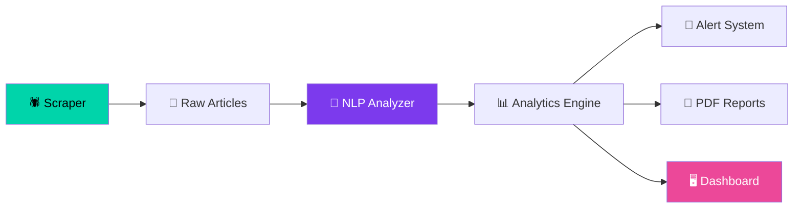

# Scout Intelligence 🔍🇸🇦

[](https://nodejs.org/)
[](https://opensource.org/licenses/MIT)
[](.github/workflows/automation.yml)
[](https://www.chartjs.org/)

> Production-grade, fully automated **Media Intelligence Platform** for the Saudi Scouts Association. Scrapes, analyzes, and visualizes 5,700+ news articles with NLP-powered insights, sentiment analysis, and real-time dashboards.

---

## ✨ Features

| Feature | Description |
|---------|-------------|
| 🕷️ **Smart Scraper** | Automated crawling with retry logic, rate limiting, and duplicate detection |
| 🧠 **Arabic NLP Engine** | Theme detection (8 categories), city recognition (70+ Saudi cities), keyword extraction |
| 💬 **Sentiment Analysis** | Rule-based Arabic sentiment scoring with positive/negative/neutral classification |
| 📊 **Interactive Dashboard** | Glassmorphism dark UI with 10+ chart types, animated counters, and particle effects |
| 🔔 **Smart Alerts** | 7 alert types including topic surges, sentiment shifts, and quality drops |
| 📄 **PDF Reports** | Auto-generated monthly executive summaries with embedded charts |
| ⚡ **Full Automation** | GitHub Actions pipeline runs every 6 hours, deploys to GitHub Pages |
| 📤 **CSV Export** | One-click export of filtered data with full Arabic support |

---

## 🏗️ Architecture



### Pipeline Stages

1. **Scraper** (`scraper.js`) — Crawls list and detail pages, normalizes dates, preserves history
2. **NLP Analyzer** (`analyzer.js`) — Arabic text processing, theme detection, city recognition, sentiment analysis
3. **Analytics Engine** (`analytics.js`) — Aggregates metrics, generates time series, quality scores
4. **Alert System** (`alerts.js`) — Detects anomalies, topic surges, sentiment shifts
5. **Report Generator** (`report.js`) — Monthly PDF summaries with embedded charts
6. **Dashboard** (`index.html`) — Real-time glassmorphism dark UI

---

## 🛠️ Tech Stack

- **Runtime:** Node.js 20+
- **Database:** Flat JSON files (GitHub-versioned)
- **NLP:** Custom Arabic processor + `Natural`, `Compromise.js`
- **Frontend:** Chart.js 4, Vanilla CSS, CSS Grid, Glassmorphism
- **PDF:** jsPDF + node-canvas
- **Automation:** GitHub Actions (Cron: Every 6 hours)
- **Hosting:** GitHub Pages

---

## 📁 Project Structure

```
├── index.html              # Dashboard (main UI)
├── styles.css              # Premium design system
├── dashboard.js            # Dashboard engine (charts, animations)
├── scripts/
│   ├── scraper.js          # Web scraper
│   ├── analyzer.js         # NLP & text analysis
│   ├── analytics.js        # Metrics aggregation
│   ├── alerts.js           # Alert system
│   ├── report.js           # PDF report generator
│   └── run_all.js          # Pipeline orchestrator
├── data/
│   ├── raw_articles.json   # Scraped articles archive
│   ├── processed_articles.json  # NLP-processed data
│   ├── analytics.json      # Aggregated metrics
│   └── alerts.json         # System alerts
├── reports/                # Monthly PDF reports
└── .github/workflows/      # CI/CD configuration
```

---

## ⚙️ Quick Start

```bash
# Clone the repository
git clone https://github.com/your-username/scout-media-intelligence-system.git
cd scout-media-intelligence-system

# Install dependencies
npm install

# Run the full pipeline
npm start

# Or run individual stages
npm run scrape      # Scrape new articles
npm run analyze     # Run NLP analysis
npm run analytics   # Generate metrics
npm run alerts      # Run alert detection
npm run report      # Generate PDF report
```

---

## 🚀 Deployment

1. **Fork** this repository
2. Go to **Settings → Actions → General** and enable "Read and write permissions"
3. Go to **Settings → Pages** and set source to `GitHub Actions`
4. The system runs automatically every 6 hours. Trigger manually via the **Actions** tab

---

## ⚖️ Ethical Scraping Notice

- Respects `robots.txt`
- Implements 1000ms rate limiting between requests
- Uses custom User-Agent identification
- Only scrapes publicly available news metadata

---

**Built with ❤️ by Scout Intelligence Team**
